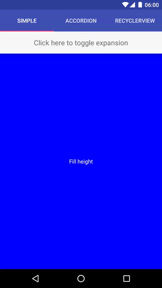
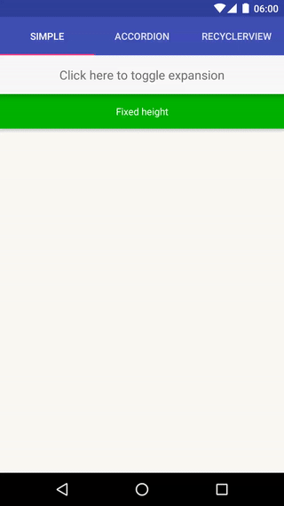
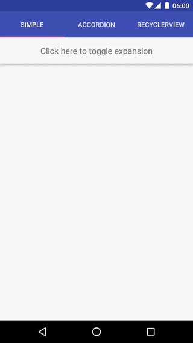
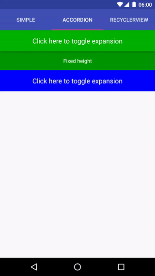
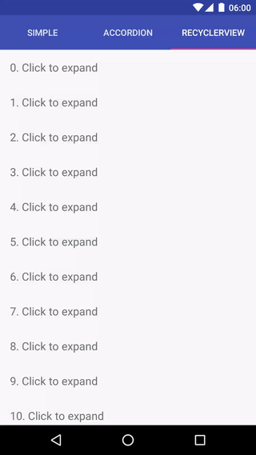

# ExpandableLayout

An Android layout class that supports animating the expansion and collapse of its child views.

I built this because all of the available libraries I tested were missing features or behaving unexpectedly in certain cases (e.g. rotation handling).

This library offloads as much work as possible to the parent layout to ensure that the rendering and size calculations behave as expected. This means that even complex features such as LinearLayout's `weight` tag are properly supported.

Currently the only implemented expandable layout is based on the framework's LinearLayout since it supports all of the requirements for my current use cases. If the need for other variants arises, it should be easy to adapt the current solution to a FrameLayout, RelativeLayout or others.

## Features

ExpandableLinearLayout supports animating:

* Views with a fixed height:



* Views with fill height (usually using weight > 0):



* Multiple views simultaneously:



* "Accordion" expansion (using two expandable layouts)



* RecyclerView items




## Usage

Reference the library from your module's build.gradle:

``` gradle
dependencies {
    [...]
    compile 'net.cachapa.expandablelayout:expandablelayout:[latest_version]'
}
```

Latest version: [  ](https://bintray.com/cachapa/maven/expandablelayout/_latestVersion)

Add the ExpandableLinearLayout as the root of the layout you want to make expandable, and mark the relevant child views as expandable using the `layout_expandable` tag:

``` xml
<net.cachapa.expandablelayout.ExpandableLinearLayout
    android:id="@+id/container"
    android:layout_width="match_parent"
    android:layout_height="match_parent"
    app:el_duration="1000"
    app:el_expanded="true">

    <TextView
        android:layout_width="match_parent"
        android:layout_height="wrap_content"
        android:text="Click here to toggle expansion" />

    <TextView
        android:layout_width="match_parent"
        android:layout_height="50dp"
        android:text="Fixed height"
        app:layout_expandable="true" />

</net.cachapa.expandablelayout.ExpandableLinearLayout>
```
Also supported are `el_duration` and `el_expanded` tags, for specifying the duration of the animation and whether the layout should start expanded, respectively.

To trigger the animation, simply grab a reference to the ExpandableLinearLayout from your Java code and and call either of `expand()`, `collapse()` or `toggle()`.

A full demo of the library is included with the project under the `demo` directory.

## License

    Copyright 2016 Daniel Cachapa.

    Licensed under the Apache License, Version 2.0 (the "License");
    you may not use this file except in compliance with the License.
    You may obtain a copy of the License at

       http://www.apache.org/licenses/LICENSE-2.0

    Unless required by applicable law or agreed to in writing, software
    distributed under the License is distributed on an "AS IS" BASIS,
    WITHOUT WARRANTIES OR CONDITIONS OF ANY KIND, either express or implied.
    See the License for the specific language governing permissions and
    limitations under the License.

## Footnotes

Gifs were generated using the following script: https://gist.github.com/cachapa/aa829bfc717fc4f1d52c568d7ae8521e
