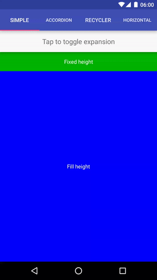
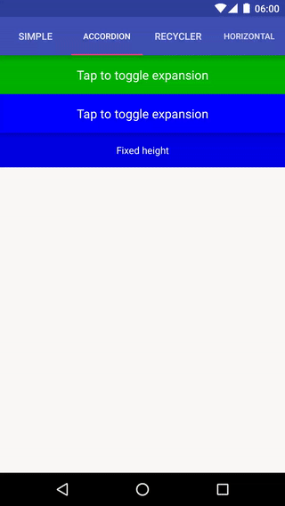
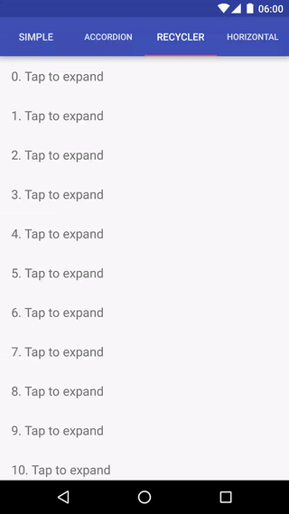
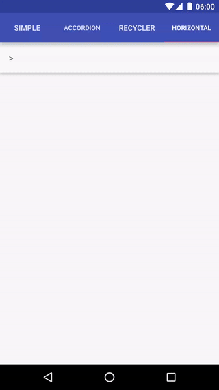

# ExpandableLayout

An Android layout class that supports animating the expansion and collapse of its child views.

I built this because all of the available libraries I tested were missing features or behaving unexpectedly in certain cases (e.g. rotation handling).

This library offloads as much work as possible to the parent layout to ensure that the rendering and size calculations behave as expected. This means that even complex features such as LinearLayout's `weight` tag are properly supported.

### Try the demo

[](https://play.google.com/store/apps/details?id=net.cachapa.expandablelayoutdemo)

### Features

ExpandableLayout supports animating:

* Views with fixed and variable heights:



* "Accordion" expansion (using two expandable layouts)



* RecyclerView items



* Horizontal expansion



### Usage

Add the Jitpack maven repository if you don't have it yet:

``` gradle
allprojects {
    repositories {
        ...
        maven { url 'https://jitpack.io' }
    }
}
```

Reference the library from your module's build.gradle:

``` gradle
dependencies {
    [...]
    implementation 'com.github.cachapa:ExpandableLayout:2.9.2'
}
```

Add `ExpandableLayout` as a container to the layout or views you want to make expandable:

``` xml
<net.cachapa.expandablelayout.ExpandableLayout
    android:id="@+id/expandable_layout"
    android:layout_width="match_parent"
    android:layout_height="wrap_content"
    app:el_duration="1000"
    app:el_expanded="true"
    app:el_parallax="0.5">

    <TextView
        android:layout_width="match_parent"
        android:layout_height="wrap_content"
        android:padding="16dp"
        android:text="Fixed height" />

</net.cachapa.expandablelayout.ExpandableLayout>
```
Also supported are `el_duration` and `el_expanded` tags, for specifying the duration of the animation and whether the layout should start expanded, respectively. `el_parallax` can be set to a value between 0 and 1 to control how the child view is translated during the expansion.

To trigger the animation, simply grab a reference to the ExpandableLayout from your Java code and and call either of `expand()`, `collapse()` or `toggle()`.

A full demo of the library is included with the project.

### License

    Copyright 2016 Daniel Cachapa.

    Licensed under the Apache License, Version 2.0 (the "License");
    you may not use this file except in compliance with the License.
    You may obtain a copy of the License at

       http://www.apache.org/licenses/LICENSE-2.0

    Unless required by applicable law or agreed to in writing, software
    distributed under the License is distributed on an "AS IS" BASIS,
    WITHOUT WARRANTIES OR CONDITIONS OF ANY KIND, either express or implied.
    See the License for the specific language governing permissions and
    limitations under the License.

### Footnotes

Gifs were generated using the following script: https://gist.github.com/cachapa/aa829bfc717fc4f1d52c568d7ae8521e
